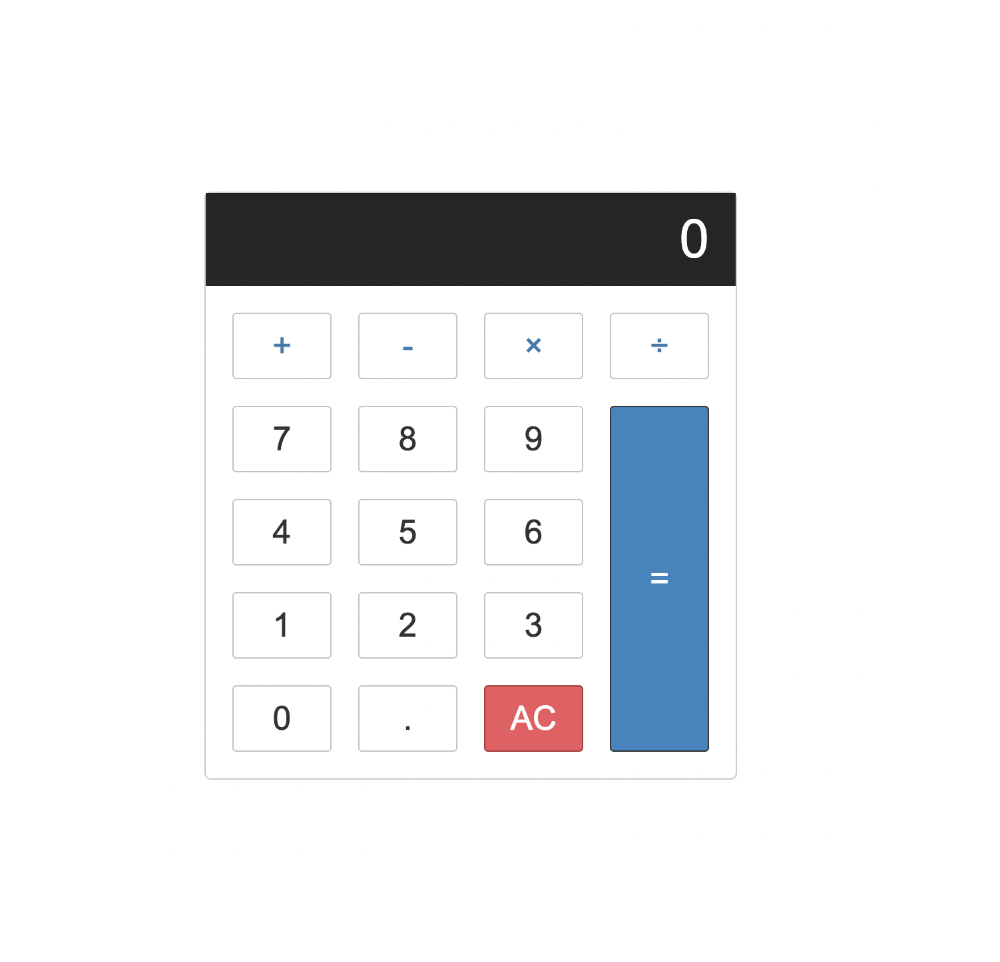

# Calculator (8-9 November 2022)

> ## Completed
> -  I created a simple calculator app using what we know about Javascript
> -  I belive that I made it pretty. :)
> - In the home page the user can enter the city of their choice
> - On clicking the SUBMIT button or pressing ENTER the application will display the weather for the next 1 day.

> ## How does the interface look?
> 